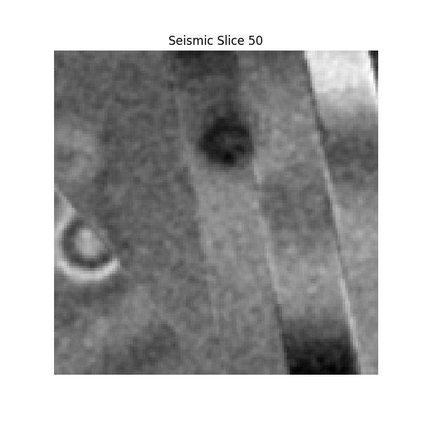

# Seismic Fault Prediction using CNNs POC

This repository implements a **3D seismic fault segmentation pipeline** using a **Convolutional Neural Network (CNN)**. It is based on the Keras version of FaultSeg3D originally developed by [Xinming Wu](http://www.jsg.utexas.edu/wu/) and team. The goal of this project is to accurately predict seismic fault probabilities from 3D seismic datasets. I refactor the pipeline part for modularization. Ggenerate overlay images and slices for easy interpretation of predictions.

---

## Features

- Train a CNN (U-Net) model for 3D seismic fault segmentation.
- Predict seismic faults from 3D seismic data files.
- Visualize predicted fault volumes and seismic slices. 

### Example Results

| raw_image: seismic                             | prediction: prediction                                 | combination: overlay                            |
| ---------------------------------------------- | ------------------------------------------------------ | ----------------------------------------------- |
| |   |  |
| |   |  |
| |   |  |

---

## Installation

Clone the repository and install the required dependencies:

```bash
git clone THIS_REPO
cd seismic_fault_prediction

# Create a virtual environment (optional but recommended)
python3 -m venv venv
source venv/bin/activate

# Install dependencies
pip install -r requirements.txt
```

### Dependencies

- `tensorflow==2.11.0` (or `tensorflow-gpu==2.11.0`)
- `keras==2.11.0`
- `numpy`
- `matplotlib`
- `scikit-image`
- `h5py`

---

## File Structure

Here is a summary of the repository structure:

```plaintext
seismic_fault_prediction/
├── config.py                 # Configuration for model and paths
├── main.py                   # Entry point for training and prediction
├── requirements.txt          # Python dependencies
├── data/                     # Placeholder for seismic and fault datasets
├── models/                   # Pre-trained and saved model weights
│   └── fseg-70.hdf5          # Example pre-trained model weights
├── model/                    # Model factory for creating CNN architectures
├── prediction/               # Fault prediction utilities
├── training/                 # Fault segmentation training pipeline
├── utils/                    # Utility functions (e.g., data visualization)
├── logs/                     # Logs for training (TensorBoard)
├── predict_output/           # Directory for prediction results
```

---

## How to Use

This pipeline can be run in two modes: **train** or **predict**. Both commands are executed via `main.py`.

### 1. Train the Model

To train a new model using the synthetic seismic dataset, run:

```bash
python main.py --mode train
```

- Ensure `data/train/seis/` and `data/train/fault/` directories contain the dataset.
- Customize training parameters in `config.py`.

### 2. Predict Fault Probabilities

To predict faults in a seismic dataset, run:

```bash
python main.py --mode predict --data-index INTEGER
```

- Replace `` with the desired seismic data file index (e.g., `2` for `validation/seis/2.dat`).
- Results are saved in the `predict_output/` directory.

---

## Configuration

The `config.py` file contains important configuration details:

- **Data Paths**: Set paths to the training, validation, and model files:
  ```python
  train_seismic_path: "./data/train/seis/"
  train_fault_path: "./data/train/fault/"
  val_seismic_path: "./data/validation/seis/"
  val_fault_path: "./data/validation/fault/"
  model_weights_path: "models/ziyu-fseg-70.hdf5" # the trained model -> models/fseg-70.hdf5
  ```
- **Model Parameters**: Modify input size, learning rate, etc.:
  ```python
  input_shape: (128, 128, 128, 1)
  batch_size: 1
  learning_rate: 1e-4
  epochs: 100
  ```

---


## Dataset

The synthetic training and validation datasets used for this project are provided by [Xinming Wu](http://www.jsg.utexas.edu/wu/). Download the datasets here:

- [Training and Validation Dataset](https://drive.google.com/drive/folders/1FcykAxpqiy2NpLP1icdatrrSQgLRXLP8)

